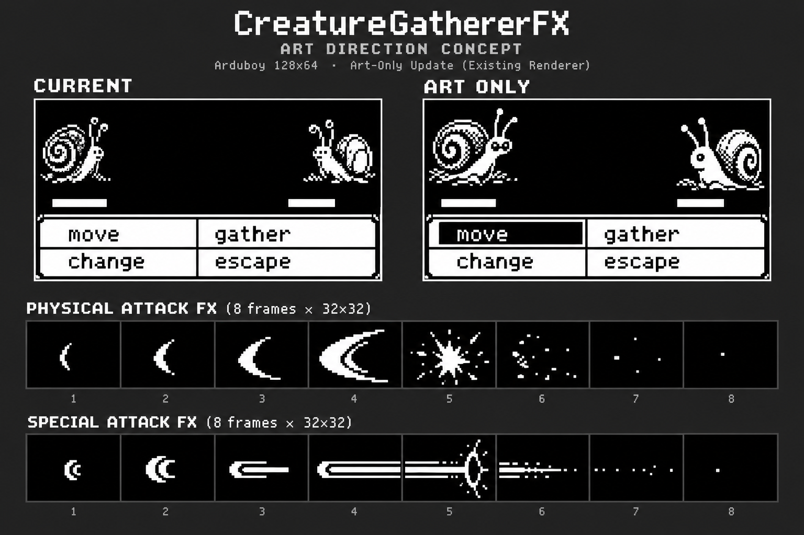

# Battle art using the existing renderer

CreatureGathererFX-6yj, 2026-10-06. This extends the presentation research with
the owner's preference for graphics changes that preserve firmware space.

**Recommendation: redraw the existing creature, physical/special effect and
four-state menu sheets without changing their formats. Target zero additional
firmware flash, zero SRAM and zero new rendering calls.** This is an art-direction
and format-feasibility spike; no canonical game PNG was replaced.



The board was made with the built-in imagegen tool using this game's creature,
menu, wave and beam sheets as references. Both panels are illustrative: the
panel labelled CURRENT is not a captured frame. Text, pixels, scaling and
individual cell boundaries are not validated production assets. Do not crop
this board into the cart or claim its enlarged geometry is pixel-exact. Use
the source contracts below for the actual redraw. Its purpose is to compare
clearer silhouettes, shell volume, baked grounding, menu selection contrast,
and a less repetitive attack sequence. The board's eighth effect cells still
show particles; the production contract below deliberately requires empty
frame 7 instead.

## What works without new device code

| Change | Existing source/path | Benefit and boundary |
| --- | --- | --- |
| Bolder creature silhouettes | `images/NewecreatureSprites_32x32.png`; drawn by `drawOpponent` / `drawPlayer` | Prioritize face/eyes, solid outer contour, readable negative space, restrained shell hatching. Large masses read better than uniform thin outlines at native size. |
| Different apparent elevation | Same 32x32 frames | Place opponent art higher and player art lower *inside* their existing tiles. The draw origins stay `(0,0)` and `(96,0)`; this is an apparent perspective cue, not a diagonal layout change. |
| Small ground/cast-shadow marks | Same frames, baked below the creature | Give the sprite a place to stand with one broken white crescent or a stepped stroke. It must fit within y=0..31 and survive the frame's alpha mask. It moves/hides with the creature and also appears in the party picker. |
| Cleaner inward-facing paired poses | Opponent even frame, player odd frame | Different shell/face emphasis can make the pair feel like combatants rather than identical silhouettes. Preserve species identity and direction; the pair is selected statically, so no idle animation can be introduced through art alone. |
| Stronger physical slash | Existing `BasicWaveL/R_32x32.png` | Turn the eight repeated crescents into anticipation, travel, edge-localized impact and sparse settle using the existing frame selection. No new category or dispatch code. |
| Concentrated special attack | Existing `basicBeamL/R_32x32.png` | Charge, narrow travelling beam and local flare; keep white mass controlled so it does not resemble the physical slash. |
| Clearer selection and menu structure | `images/fightMenu_128x24.png`, four baked menu states | Broaden the selected label's reversed area, improve spacing/rules and use the same wording. Each selection state is already a frame; no dynamic widget is needed. |
| Quieter menu backing | `images/battleMenu_128x24.png` | Adjust border weight only while leaving current glyph/cursor slots white and clear. This image is reused by dialogs and party/move selection, so test those screens too. |

White hatching on a black display is a highlight, not a dark shadow. Use black
cut-outs inside white bodies for volume; reserve dense stipple for small shell
regions. Avoid decorating every pixel. The tiny screen benefits more from
silhouette and negative space than a detailed field texture.

## What graphics alone cannot do

- The dynamic HP fills are drawn by `fillRect` at y=36 outside creature tiles;
  their clear rectangles cover y=34..39. Changing the creature/menu PNGs cannot
  outline the track, draw exact HP, change its 30-pixel width, preserve a
  one-pixel living fill, or animate its drain. Baking a bar into a creature
  tile would create a second fake bar, not improve the authoritative one.
- Menu art begins at y=40. It cannot add HUD pixels above that boundary.
  Baking HP labels into the lower edge of every creature sprite would also
  show orphan labels in the party preview and is not recommended.
- `images/fieldBacground_128x32.png` is packaged but `drawScene` makes no draw
  call to it. A new background image alone has no visible effect.
- `BattlePresenter::draw` fills `(0,40,128,24)` white and draws feedback
  directly. Redrawing `battleMenu` will not add a border to this feedback path.
  The idea of a bordered feedback box needs a small separate code change.
- No extra idle pose, true back-sprite animation, status icon, numeric HUD,
  faint animation or switch reveal becomes selectable just by appending art.
  The renderer still selects the same two species frames and eight effect
  frames. Additional animation-group selection is separately budgeted work.
- The effect remains confined to a middle-strip slot and runs during Announce,
  before the HP jump/Impact shake. Artwork can suggest a stronger attack,
  but cannot make the victim react earlier or move an effect onto its body.

## Frozen replacement formats

These counts were checked against the generated C-array payloads and native
sprite encoder. Retain all symbols, order, dimensions, shade count and mask
mode so packed offsets remain fixed. Change the canonical PNG sources and
use `make gen`; never edit generated arrays or packed bytes by hand.

| Asset | PNG size | Logical frames | Encoding/payload to retain |
| --- | --- | --- | --- |
| `NewecreatureSprites_32x32.png` | 64x1024 | 64 frames, 32x32, row-major | 1bpp PLUSMASK, 256 B/frame, 16384 B total |
| `BasicWaveL_32x32.png` | 256x32 | 8 frames, 32x32 | 1bpp PLUSMASK, 2048 B total |
| `BasicWaveR_32x32.png` | 256x32 | 8 frames, 32x32 | 1bpp PLUSMASK, 2048 B total |
| `basicBeamL_32x32.png` | 256x32 | 8 frames, 32x32 | 1bpp PLUSMASK, 2048 B total |
| `basicBeamR_32x32.png` | 256x32 | 8 frames, 32x32 | 1bpp PLUSMASK, 2048 B total |
| `fightMenu_128x24.png` | 128x96 | 4 frames, 128x24, top-to-bottom | Opaque 1bpp, 384 B/frame, 1536 B total |
| `battleMenu_128x24.png` | 128x24 | 1 frame | Opaque 1bpp, 384 B total |

Masked encoding is selected if the PNG has *any* alpha below255. Making an
entire creature/effect sheet opaque halves its payload, changes later offsets
and breaks the PLUSMASK call's interpretation. Likewise, adding transparency
to an opaque menu sheet doubles its payload while the caller still uses
OVERWRITE. Preserve mask mode explicitly; shades=2 does not enforce it.
Use RGBA pixels with alpha0/255 and black/white visible RGB, no antialiasing.

The native encoder derives32x32/128x24 from filename suffixes, traverses frames
row-major, and emits page-major interleaved pixel/mask bytes. No dimensions
header is prepended to these sprite symbols. Creature frame `id*2` is the
opponent, `id*2+1` the player; raw species0 is valid and255 remains absent.
Inspect first, last (31) and tiny/large silhouettes before extending to all32
species. Altering this shared sheet also alters the party preview.

## Concrete first art slice

Implementation follow-up: **CreatureGathererFX-86e**, with the zero-growth
format/HEX contract below. The earlier HUD/playback/scene tickets remain
separate code work within their shared flash allowance.

Start with the two paired effect sheets and four menu states. They affect
every fight without a32-species art pass. Retouch one ordinary creature pair
and species31 only as a style check; do not silently publish a mixed-quality
full roster. Once the style is settled, apply it consistently to the remaining
species. These are individual art checkpoints, not a new general renderer.

For creature tile content, use local enemy silhouette bounds x=2..29,y=2..26
with a broken ground stroke at y=28..30; player x=2..29,y=5..29 with a compact
stroke at y=30..31. Preserve small-species identity rather than scaling every
species to fill those bounds. Those are art envelopes; foreground pixels and
mask must remain within32x32. At the current outer-edge draw origins, the
existing two-pixel shake can clip edge art; the internal horizontal margin
reduces that without a code change. Ground is part of the masked tile and
must not survive when a fainted creature is hidden.

For `fightMenu`, preserve four states in the current selection order:
move, gather, change, escape. Keep existing two-column/two-row word anchors
and cursor clearances; let selected words have white text on a larger black
capsule while the other three are black on white. Do not add text or alter
the controller's row model. Move/party menu backing must not cover dynamic
names, PP or cursors. The white feedback panel remains as it is.

### Eight frames already have useful timing

Existing frame selection is `floor(elapsed*7/41)` during42-tick Announce at
52fps. It does **not** give every frame equal dwell. Use this measured formula
to draw an animation, not an assumed eight equally spaced frames:

| Frame | Elapsed ticks | Existing dwell | Suggested art role |
| --- | --- | --- | --- |
| 0 | 0..5 | 6 ticks | Small compressed physical crescent / small special charge |
| 1 | 6..11 | 6 ticks | Anticipation shape/charge grows |
| 2 | 12..17 | 6 ticks | Attack begins travelling through the slot |
| 3 | 18..23 | 6 ticks | Wide physical slash / thin directed beam |
| 4 | 24..29 | 6 ticks | Compact bright hit flare at target-facing slot edge |
| 5 | 30..35 | 6 ticks | Smaller hit/recoil shape, readable on A acceleration |
| 6 | 36..40 | 5 ticks | Sparse debris/ring settles, readable on A acceleration |
| 7 | 41 | 1 tick | Fully transparent terminal frame; never put essential detail here |

Player attacks use the L sheet at `(32,0)`: enemy lies to its left, so travel
runs toward local x=0 and hit detail occupies x=0..7. Opponent attacks use
the R sheet at `(64,0)`: player lies to its right, so travel runs toward
local x=31 and hit detail occupies x=24..31. Mirror the four sheets to these
contracts; do not copy a concept-board arrow direction unquestioningly.
Keep effect pixels within y=2..29, leaving HP and feedback untouched.

A fresh A edge jumps to elapsed33 on the first accelerated Announce update,
so frames0..4 may be skipped. Put intelligible attack content in frames5/6,
and clear it in frame7. The following code-driven Impact lasts21 ticks; this
art pass cannot synchronize an impact sprite with that later stage.

## Flash evidence and acceptance

The existing source filenames/formats produce headerless fixed-length fields.
Replacing pixels while preserving those lengths and declaration order should
leave `src/fxdata.h` offsets unchanged; firmware refers to those offsets and
does not compile the pixel payload. Thus **0 B firmware growth is a testable
acceptance requirement**, not a claim that this unconverted concept board was
already packed and measured. FX storage and SRAM need not grow either.
The current masked blitter visits every column regardless of transparent or
white pixel count. With unchanged dimensions/mode/frame selections, denser
shell shading or different mask contours do not introduce more blits or more
pixel-byte reads; they replace the data consumed by the existing loop.

The unchanged current firmware is validated by the spike's final gate; exact
numbers are recorded in `output.md`. A real asset replacement must additionally:

1. Record the pre-art shipping build/ELF and generated header. Run `make gen`
   after canonical edits and verify unchanged field offsets and payload sizes.
2. Run `make ram` with identical flags and compare `.text`/`.data`/`.bss` and
   shipping HEX against that baseline. Require identical HEX for this art-only
   slice; do not accept address-growth explanations as permission to spend flash.
3. Add permanent framebuffer/asset tests for representative ordinary/31/sentinel
   creatures, physical/special in both directions, every menu state and frame7
   transparency. Keep existing playback/state tests unchanged. First focused
   device checks pair presentation with `test_stack`.
4. Run `make test`, `make testvm`, `make verify-generated`, generated-library
   checks and `make final-gate ARDENS=/path/to/headless-ardens`.
5. Packed pixels intentionally change, so update the committed pack-parity SHA
   to the verified new image through the approved source change, then run
   `make test-pack-parity`. That script checks both layout equivalence and a
   literal whole-cart baseline; an old SHA is expected to fail on new artwork.
   An unchanged generated header does not imply unchanged cart pixels.

No new bitmap/framebuffer tests were written for this concept-only deliverable:
there is no retained production asset delta to assert. Existing automated
checks remain acceptance evidence; manual Ardens observation is not required.

## Generation record

Tool: built-in `image_gen.imagegen`, reference-driven concept generation,
opaque output. Saved project copy: `docs/assets/battle-art-only-concept.png`.
Canonical sources and consuming code were not overwritten. The generation
prompt follows verbatim, so the preview can be reproduced or narrowed later.

```text
Use case: ui-mockup / style-transfer. Create a disciplined art-direction comparison board for CreatureGathererFX, an Arduboy 128x64 monochrome game. The referenced sprite sheet contains ORIGINAL snail and creature artwork, not Pokemon; retain their identities. This is a concept preview for changing ONLY BITMAP ART inside existing renderer slots, not a new UI or renderer. Board on neutral dark gray with two enlarged pixel-perfect-looking 128x64 battle screens, and two strips of eight 32x32 attack animation frames below. Left screen labelled 'CURRENT', right 'ART ONLY'. Current screen: black canvas, original snail creature opponent in fixed 32x32 slot at x0 y0, original player snail facing inward in fixed32x32 slot at x96 y0. Top scene otherwise empty. Two unchanged tiny white horizontal HP fills at x8 y36 and x90 y36; NO HP labels, numbers, new HUD, bar borders, health colors, or added field background. Bottom at y40..63 uses existing white two-column menu, with original wording 'move', 'gather', 'change', 'escape'. Art-only screen: SAME draw slots, menu coordinates and unchanged tiny HP fills; redraw the two ORIGINAL snail sprites in bolder white silhouettes with black interior cavities and restrained stipple shading, credible shell volume, clearer face and inward facing pose. Bake small curved ground strokes INSIDE each 32x32 sprite tile only, never outside; enemy snail sits near top of its tile and player snail sits lower inside its tile to suggest a slight perspective stagger without moving the draw origin. Make selected 'move' menu choice clearly reversed black with white text and quieter consistent menu rules; no new wording/icons requiring runtime drawing. Two animation strips use only black/white/transparent-style black canvas within existing eight32x32 cells: PHYSICAL = crisp small anticipation crescent then accelerating broad inward-facing slash, compact bright impact star, sparse debris and clean settle; SPECIAL = small concentrated charge then narrow straight beam, short flare/ring at target and clean settle. Do not show effects over creature slots, HP bars or lower text box. All sprite/effect tiles binary BLACK and WHITE, hard square pixels, no anti-aliasing/blur/gradients/grayscale inside game graphics. Surrounding board labels may use readable plain typography. No Pokemon assets. Do not invent extra health/status/level panels. Image is a CONCEPT BOARD, not claim of a production-ready sprite sheet.
```
