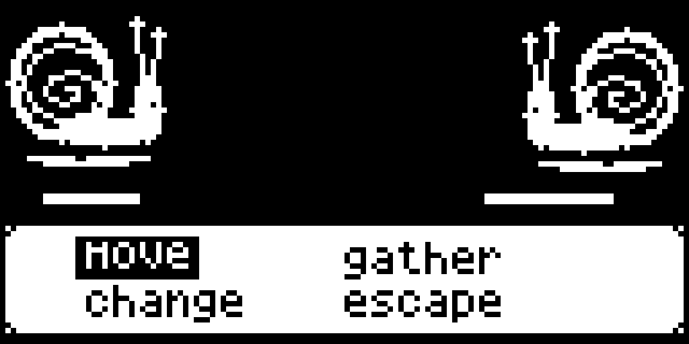

# Strict black-and-white battle mockup spike

CreatureGathererFX-dg1, 2026-10-06. The owner asked to run the spike and present
a mockup after clarifying the black/white-only hardware.



[Native 128x64 PNG](assets/battle-bw-native.png) · [SVG source](assets/battle-bw-native.svg)

The native mockup is a **128x64 binary pixel grid**, stored as a 1-bit grayscale PNG and presented at 8x by pixel replication:
only #000000 and #FFFFFF. Its 397 white horizontal runs all lie on
integer logical coordinates. It is an artwork proposal, not a device capture.
The white silhouettes/black shell cut-outs and ground marks fit inside the
existing two32x32 sprite slots; HP fills remain at y36. Menu labels come from
the existing generated fightMenu raster, including its selected move backing. No numbers, new HUD, background draw or timing change
is depicted. The snail shapes are a code-native vector mockup inspired by the
original pair, not a committed replacement sprite sheet.

An [enlarged imagegen art sketch](assets/battle-bw-mockup.png) is also retained.
It uses the original creature and menu PNGs as references and removes the gray
surround from the earlier board. Its1774x887 output is **not** the native pixel
grid or a validated1bpp source asset; use the native PNG above to judge real pixel
space. The sketch was generated using built-in imagegen, not the CLI fallback.
No existing PNG was overwritten. The actual fixed-format art replacement
remains open as CreatureGathererFX-86e.

## Executed spike

```sh
make fxtest-spike BUILD_DIR=build/battle-bw-mockup/spike \
  FXTEST_SPIKE_INO=tst/fxdatatest/test_battlepresentation.ino FXTEST_MS=10000 \
  ARDENS=/Users/connorfranc/code/Ardens/build/Ardens.app/Contents/MacOS/Ardens
make ram BUILD_DIR=build/battle-bw-mockup/ram
cmp build/battle-art-only/final/CreatureGathererFX.ino.hex \
  build/battle-bw-mockup/ram/CreatureGathererFX.ino.hex
xmllint --noout docs/assets/battle-bw-native.svg
make final-gate BUILD_DIR=build/battle-bw-mockup/final FXTEST_MS=10000 \
  ARDENS=/Users/connorfranc/code/Ardens/build/Ardens.app/Contents/MacOS/Ardens
```

Focused presentation268/0, stack4/0. Presenter338 B painted /269 B effective
headroom; caption383/314 B; test_stack423 B painted. Shipping27482 B flash /
1787 B static RAM; physical flash remaining2214 B. The shipping HEX comparison
passes: **this mockup-only spike costs0 device firmware bytes**. It does not
prove a production asset swap until86e converts, packs and checks actual art.
The full gate passed: host 157573/0, world 190/0, VM 42/0, generated checks
and all 28 FX suites. Detailed results are recorded in output.md. It verifies the
unchanged game; the proposed SVG/PNG is not exercised by those device tests.

Generation prompt for the enlarged sketch, verbatim:

```text
Create ONE hardware-faithful monochrome pixel-art battle screen mockup for CreatureGathererFX. Reference 1 is the game's ORIGINAL creature sprite sheet, reference 2 the game's original four-state menu. Use the first snail species pair from reference 1, not Pokemon. Output ONLY the rectangular game screen, landscape aspect 2:1, with absolutely no titles, borders outside the screen, labels outside the game, gray background, gradients, antialiasing, color, glow or smooth illustration. ONLY pure solid BLACK (#000000) and WHITE (#FFFFFF) anywhere in the image. Design on a visibly coarse 128-by-64 logical pixel grid and enlarge uniformly with hard square pixels. This is a single mockup, not a concept board or comparison. STRICT EXISTING RENDERER GEOMETRY: black scene at logical y0..39; opponent inward-facing snail wholly within x0..31,y0..31; player's inward-facing snail wholly within x96..127,y0..31. Center x32..95 otherwise BLACK. Keep the two actual HP fills as simple thin WHITE horizontal lines at x8,y36 and x90,y36; no extra HP labels, numbers, outlined tracks, names, level/status boxes, or UI above the menu. Improve ONLY art within the existing 32x32 creature slots: stronger readable white silhouette, black carved shell grooves and body negative space, clear face/eyes, chunky pixel clusters. Opponent silhouette slightly higher in its tile, player silhouette slightly lower in its tile; tiny broken WHITE ground/cast-shadow crescent baked INSIDE each32x32 tile. Do not paint a field background or move the sprite slots. Existing bottom white menu must occupy logical x0..127,y40..63, two columns/two rows, original small 5x6-pixel-style lowercase words exactly 'move', 'gather', 'change', 'escape'. Positions: 'move' near x14,y43, 'gather' near x64,y43, 'change' near x14,y52, 'escape' near x64,y52. Highlight selected 'move' using WHITE letters on a BLACK capsule contained within its cell. Other labels BLACK on WHITE. Thin black menu rules only, no decorative RPG framing. Menu letters and creatures must look like actual coarse tiny Arduboy pixels, not fine-resolution 8-bit-style artwork. No particles outside the two32x32 slots, no animation strip, no invented creature or environment. Pure black-white all the way to outer edges.
```
