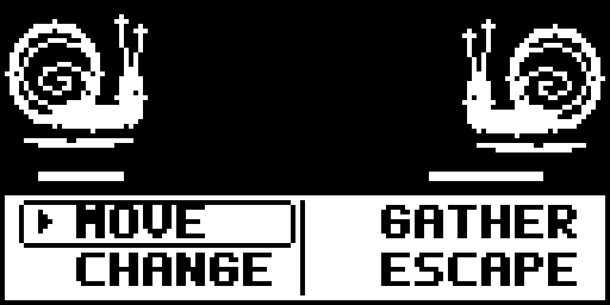
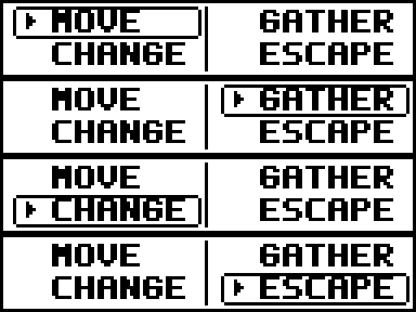

# Battle menu refinement

CreatureGathererFX-tot, 2026-10-06. Revision of the previous black-and-white
battle mockup following the owner's menu feedback.

[Native 128x64 PNG](assets/battle-menu-refined.png) ·
[Pixel SVG](assets/battle-menu-refined.svg)

The menu uses chunky uppercase bitmap lettering, derived from 5x7 glyphs with
two-pixel-wide vertical strokes and a seven-pixel character advance, equal padding,
a thin outer frame and column divider. Selection uses an outlined cell and a black arrow, keeping black text on
white for every label. The owner found white text on a black backing hard
to read; this revision removes the reversal and increases letter weight.
MOVE/GATHER/CHANGE/ESCAPE retain the existing two-column navigation order.
The battle scene and HP pixels above row40 are unchanged from the earlier
mockup. This is a code-native pixel visualization, not an emulator capture.

[Native 128x96 four-state sheet](assets/battle-menu-refined-states.png)

All artwork is binary black/white, stored in 1-bit grayscale PNGs. Enlargement
replicates pixels without smoothing. Each menu occupies128x24, with states
stacked vertically to match the existing fightMenu source grid. Column origins
are0 and64; labels begin at local x16 and y3/13, occupy 6x7 pixels per glyph and fit
within their cells. Selected outline occupies local x4..61, y2..11 or12..21.
The original pixel assets used lowercase lettering; uppercase is an art
proposal and does not change command names or input behavior.

Only documentation previews changed. No canonical PNG, generated artifact,
firmware, RAM allocation or cart payload changed. A real sprite replacement
still belongs to CreatureGathererFX-86e and must pass its fixed-size generation,
packing and byte-identical firmware checks. This preview shifts the baked
label anchors within the existing bitmap; production anchors should be pinned
in that bead before implementation. This is not evidence that new art has
been packed or exercised by device tests.

Validation and whole-image figures are recorded in output.md.
