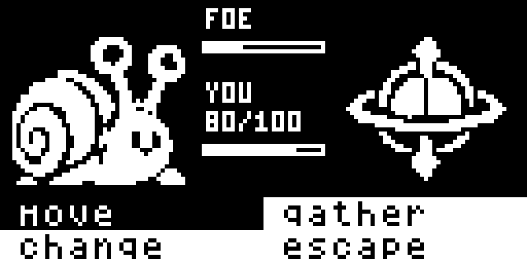
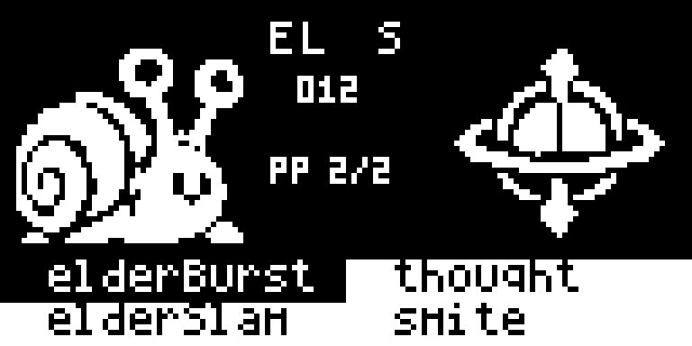
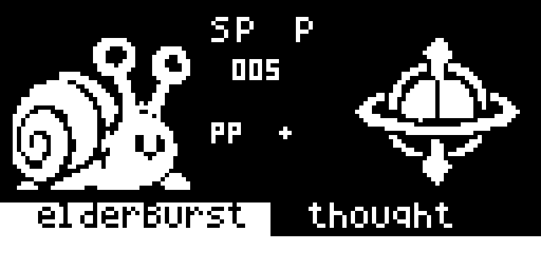
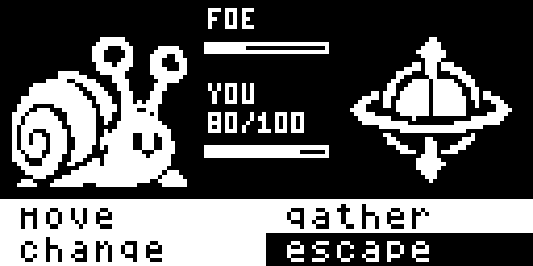

<!doctype html>
<html lang="en"><meta charset="utf-8"><meta name="viewport" content="width=device-width,initial-scale=1">
<title>48×48 battle layout</title>

<h1>48×48 battle layout</h1>

Actual 128×64 device framebuffer captures. Opponent and player use native 48×48 front/back sprites. The center labels FOE with a health bar and YOU with current/max HP, or shows selected move details; the bottom holds four choices.

<section>
<figure><figcaption>Options: compact FOE/YOU labels, thin bars, and player HP without leading zeroes.</figcaption></figure>
<figure><figcaption>Moves: full cell selection; type, category, power and remaining PP in the center.</figcaption></figure>
<figure><figcaption>Empty move slots stay blank; unlimited PP has an asterisk.</figcaption></figure>
<figure><figcaption>Escape selected through the production menu renderer.</figcaption></figure>
</section>

Shipping firmware: 27,678 bytes flash and 1,787 bytes static RAM. Device render average: 6.370 ms, within the 19.23 ms frame budget. Stack test: 420 bytes headroom (previously 423).

This is the default battle layout: <code>make battle-test BATTLE_TEST_EXPANSION=1 ARDENS=/path/to/Ardens</code>. Existing battle feedback temporarily overlays the bottom eight sprite rows.

<a href="battle-roster-balance.html">All 64 creatures with actual 48×48 sprites</a>

</html>
