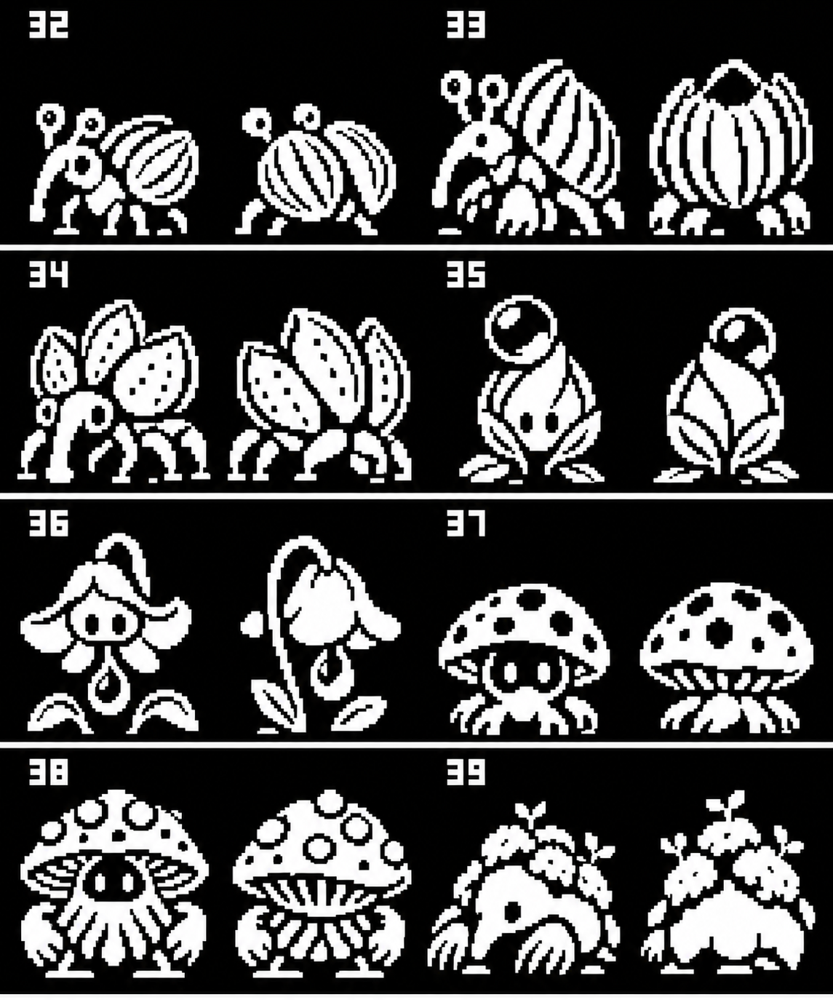
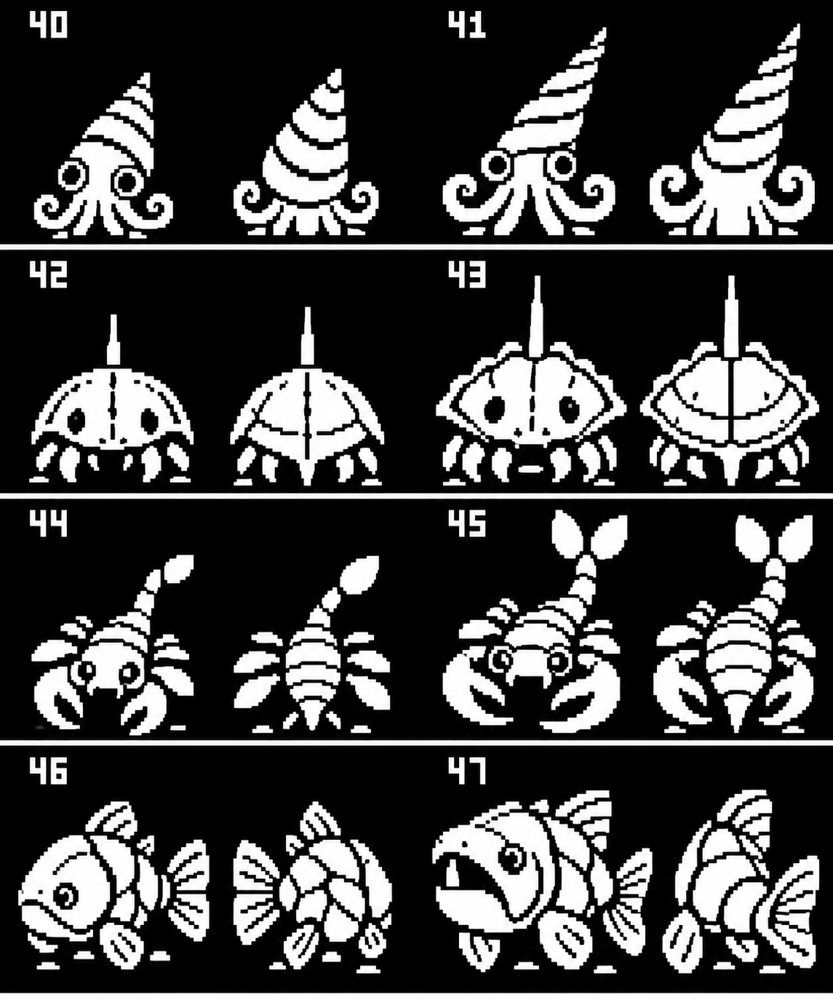
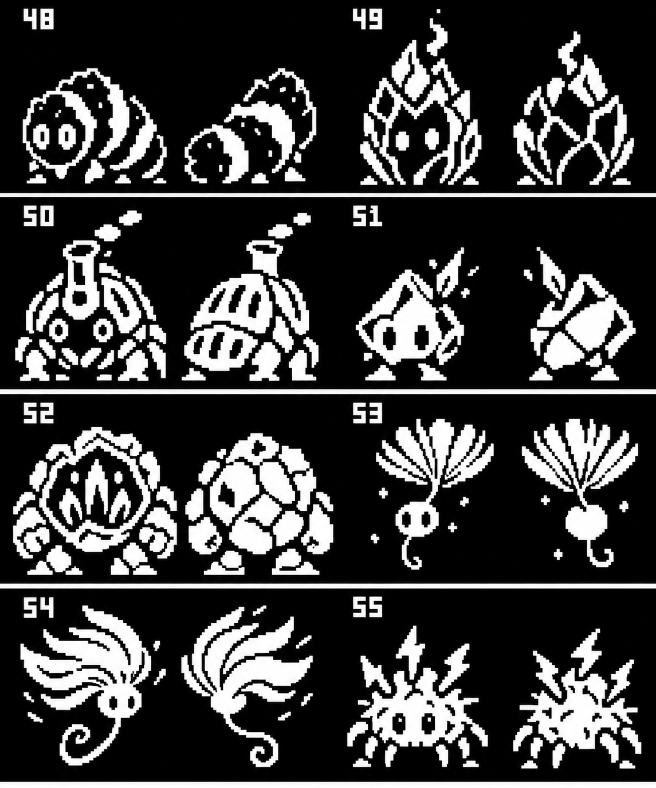
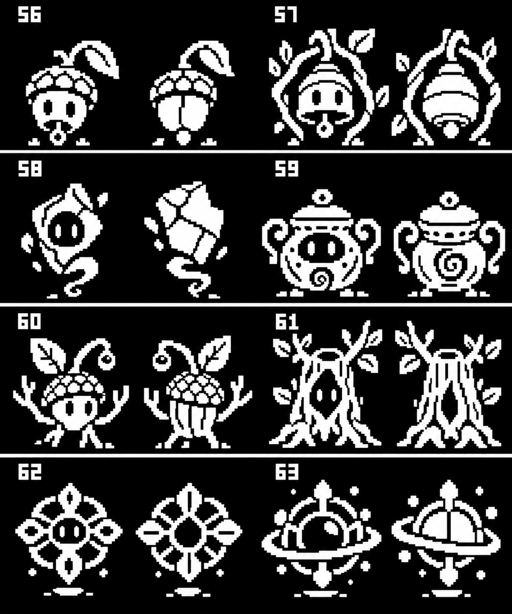

# A second creature roster built around gathering

CreatureGathererFX-63v, 2026-10-06. **32 new creature concepts**, numbered32–63
for discussing the boards. These are proposal labels, not assigned game IDs.

[Open the expansion gallery](creature-expansion-mockups.html) ·
[Validated32x32 and48x48 size instances](creature-native-sprites.html) ·
[Existing roster gallery](creature-roster-mockups.html)

The notes describe gathering materials from fields and creatures, placing them
in lure boxes, finding new creatures and moving to the next area. These designs
make that loop visible in their bodies: husks, seeds, dew, spores, shell plates,
mineral chips, pottery fragments and sap. Materials can be collected as loose
or shed pieces; designs do not require defeating a creature to gather from it.
Common seed/plant/shore creatures provide early ingredients; fossil and grove
creatures suggest later discovery chains. Exact availability, balance and lure
recipes remain design proposals.

## Sources used

- [Generated Ideas](../Notes/Generated%20Ideas.md): eight elemental habitats,
  botanists/herbalists, archaeologists/miners and ancient-grove conservationists.
- [Creatures](../Notes/Creatures.md): weevils are an explicit animal suggestion.
- [Gathering](../Notes/Gathering.md) and [Gathering Materials](../Notes/Gathering%20Materials.md):
  creature/field materials, lure zones, materials with different durations.
- [Plant Gathering](../Notes/Plant%20Gathering.md): seed-to-pickable growing plants.
- [Fossil Gathering](../Notes/Fossil%20Gathering.md): Orthoceras, horseshoe crabs,
  radiolarians, eurypterids, armored fish and Hyneria are explicitly suggested.
- [Area themes](../Notes/Area%20themes.md), [lure zones](../Notes/lure%20zones.md)
  and [Gameplay Loop](../Notes/Gameplay%20Loop.md): materials draw creatures in
  distinct habitats and feed discovery/progression.

Existing source roster: [data/json/creatures.json](../data/json/creatures.json).
The current shells, crabs, squid, insects, plants, weather shapes, spirits and
abstract Elder creatures establish the visual family. New designs use the
same eight types and simple quirky faces; plant/earth gathering creatures and
ancient aquatic forms broaden that family. Names/types/materials/lures below
are newly proposed, not existing item records.

Possible family progressions: Nib→Husk→Granary Weevil; DewBud→NectarBloom;
Sporeling→SporeKeeper; Conelet→SpireSquid; Horseshoe→Shieldshoe;
SiltSkorp→ReefReaper; CoalGrub→CinderCocoon→FurnaceBeetle;
Flintling→GeodeGuard; Tuftling→GustTuft; ChimeSeed→BoughBell;
ShardWisp→Reliquary; SaplingSage→GroveKeeper; FossilBloom→OrbitRelic.
These are concept relationships without evolution levels or committed rules.
Platefin, AncientJaw, MossMole and StaticMite are independent proposals.

## Meadow and harvest (32–39)

| Concept | Types | Gathered material | Proposed lure | Habitat |
| --- | --- | --- | --- | --- |
| 32 NibWeevil | plant | Seed Husk | Ripe seeds | meadow |
| 33 HuskWeevil | plant/earth | Dry Husk | Dry husks | field margins |
| 34 GranaryWeevil | plant/earth | Grain Dust | Grain bundles | harvest fields |
| 35 DewBud | plant/water | Dew Bead | Dew-soaked leaves | stream banks |
| 36 NectarBloom | plant/water | Nectar Drop | Flower nectar | wet meadows |
| 37 Sporeling | plant/spirit | Spore Puff | Damp bark | forest floor |
| 38 SporeKeeper | plant/spirit | Spore Cluster | Spore bundles | shaded groves |
| 39 MossMole | earth/plant | Moss Tuft | Root bundles | woodland soil |

## Shore and fossils (40–47)

| Concept | Types | Gathered material | Proposed lure | Habitat |
| --- | --- | --- | --- | --- |
| 40 Conelet | water/earth | Shell Flake | Shell fragments | shallow fossil pools |
| 41 SpireSquid | water/elder | Ancient Shell | Fossil pieces | deep fossil pools |
| 42 Horseshoe | water/earth | Carapace Chip | Shell grit | tidal flats |
| 43 Shieldshoe | earth/elder | Old Carapace | Fossil carapace | cave shallows |
| 44 SiltSkorp | water/earth | Silt Scale | River silt | riverbed pools |
| 45 ReefReaper | water/elder | Ancient Scale | Fossil scale | submerged ruins |
| 46 Platefin | water/earth | Armor Flake | Mineral shell grit | rocky streams |
| 47 AncientJaw | water/elder | Shed Tooth | Fossil teeth | deep cave lakes |

## Minerals and weather (48–55)

| Concept | Types | Gathered material | Proposed lure | Habitat |
| --- | --- | --- | --- | --- |
| 48 CoalGrub | fire/earth | Coal Crumb | Warm charcoal | volcanic soil |
| 49 CinderCocoon | fire/earth | Cinder Flake | Warm cinders | lava-field margins |
| 50 FurnaceBeetle | fire/earth | Heat Shard | Coal bundles | volcanic fields |
| 51 Flintling | earth/lightning | Flint Chip | Flint rubble | rocky slopes |
| 52 GeodeGuard | earth/lightning | Crystal Flake | Crystal fragments | mines |
| 53 Tuftling | wind/plant | Seed Fluff | Fluffy seeds | open plains |
| 54 GustTuft | wind/plant | Wind Tuft | Seed-fluff bundles | windy valleys |
| 55 StaticMite | lightning/plant | Charged Burr | Dry burrs | storm meadows |

## Shrines and ancient groves (56–63)

| Concept | Types | Gathered material | Proposed lure | Habitat |
| --- | --- | --- | --- | --- |
| 56 ChimeSeed | spirit/plant | Chime Husk | Hollow seed husks | grove shrines |
| 57 BoughBell | spirit/plant | Resonant Husk | Chime-husk bundles | sacred groves |
| 58 ShardWisp | spirit/earth | Pottery Dust | Weathered pottery | ruins |
| 59 Reliquary | spirit/elder | Relic Dust | Ancient pottery | old shrines |
| 60 SaplingSage | plant/elder | Sap Bead | Fresh sap | ancient grove edges |
| 61 GroveKeeper | elder/plant | Amber Sap | Sap bundles | ancient groves |
| 62 FossilBloom | elder/plant | Lattice Flake | Fossil fragments | fossil caves |
| 63 OrbitRelic | elder/spirit | Relic Pollen | Lattice fossils | buried grove ruins |

## Sprite size requirements

The owner asked whether these comply: **no, not as production sprites**.
The generation brief asks for coarse32x32-style designs, but the output is an
enlarged board rather than individual32x32 tiles. Silhouettes, fine details
and floating smoke/sparks still need to be resolved on the actual grid.

| Requirement | These boards | Required native pass |
| --- | --- | --- |
| Each front/back view32x32 | Approximate pixel style; not verified tile geometry | All body, particles and ground stay within each32x32 tile |
| Visible pixels black/white | RGB sketches; edges can contain intermediate values | Binary black/white pixels |
| Masked creature draw | Opaque black board background | Visible black/white plus explicit alpha0/255 mask |
| Two views per proposed species | Paired concept drawings |64 validated frames for32 proposed species |

## Preview boundary and files

Built-in imagegen creates four eight-species boards using the existing roster
mockups as style references. Each concept has paired front/back battle views.
These enlarged RGB art sketches are not validated binary32x32 sprite tiles;
cell boundaries, apparent pixel size and antialiased edges need a deliberate
native pixel pass before production. No new creature is packed into the game.
Actual roster expansion needs its own data/limits/budget review; no claim that
adding32 shipping species is a zero-firmware-cost change.

All concept motifs and local source pointers are retained in
[concepts.json](assets/creature-expansion/concepts.json). Exact generation
prompts are retained in [prompts.json](assets/creature-expansion/prompts.json).
No canonical PNG, game JSON, generated files, device code or cart bytes change.
Validation and current whole-image resources are recorded in output.md.
