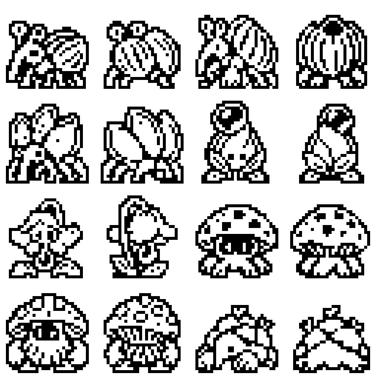
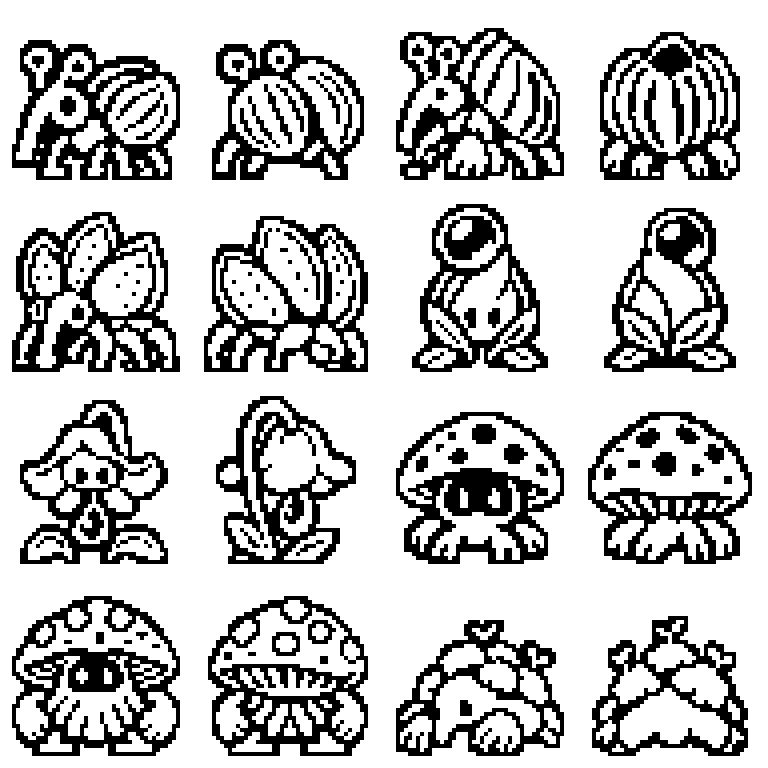

# Native-size expansion sprite instances

CreatureGathererFX-n5f, 2026-10-06. The owner requested32x32 and48x48
instances of every newly proposed creature view.

[Open the size comparison gallery](creature-native-sprites.html)

- [32x32 download](assets/creature-expansion/native/sprites-32x32.zip):64 individual PNGs and64x1024 paired sheet.
- [48x48 download](assets/creature-expansion/native/sprites-48x48.zip):64 individual PNGs and96x1536 paired sheet.
- [Full export manifest](assets/creature-expansion/native/manifest.json):source atlas, crop, pair scale and pixel counts for all128 files.

All32 proposed species32..63 have front and back views at both exact sizes.
Exported visible RGB values are only black/white; alpha is only0/255. The PNG
container is RGBA8, appropriate for retaining both1bpp artwork and a separate
binary transparency mask. It is not a1-bit grayscale PNG with no mask.
Every sprite is nonempty and has a transparent outer border.32px instances
reserve2px margins;48px instances reserve3px. Black bodies/cutouts remain
opaque black, rather than being erased as if all black were background.

## Creation and validation

Built-in imagegen edits each original eight-species concept board into a clean
transparent sixteen-view atlas, removing labels and rules while preserving
the proposed creatures. Exact atlas prompts are retained in
[atlas-prompts.json](assets/creature-expansion/native/atlas-prompts.json).
These are edits of the sketches, so small detail differences can occur.

The generated atlases are1254x1254 RGBA images with uneven cell placement.
The exporter detects fully transparent gutters rather than assuming equal
cells. It refuses to cut through opaque sprite content. Crops and ordering are
recorded in the manifest; all16 cells of each atlas were visually inspected.
Front/back bounding boxes use a common scale within each species, preserving
relative view proportions and a common bottom alignment. Each size is sampled
independently from its higher-resolution atlas, then color and alpha are
quantized.48px is not a stretched32px image.

These are deterministic size instances, not hand-retouched native pixel art.
Some fine details simplify at32px and could benefit from an art polish pass.
They now meet the requested size/palette/mask checks; gameplay integration,
balance and final art acceptance remain separate.48px sprites do not fit the
current32px draw slots and are comparison assets. No canonical game assets,
generated headers, JSON creature records, firmware or cart bytes changed.

Recreate the preview PNGs from the retained atlases:

```sh
node tools/creature-sprite-export.mjs
node --test tools/tests/creature-sprite-export_test.mjs
```

This preview utility writes only under docs/assets/creature-expansion/native.
Canonical game generation still uses make gen exclusively. The128-file asset
tests check coverage, actual file dimensions, masks, palette and paired-sheet
ordering. Resource checks and exact commands are recorded in output.md.

## 32x32 preview, enlarged6x



## 48x48 preview, enlarged4x



Both previews appear at the same overall display size; use the gallery's
Actual pixels setting to compare their native footprints.

Paired-sheet rows follow proposal labels32..63; sheet row0 is concept32.
These labels are not active game IDs. Packing and real ID allocation require
a separate roster integration change.
