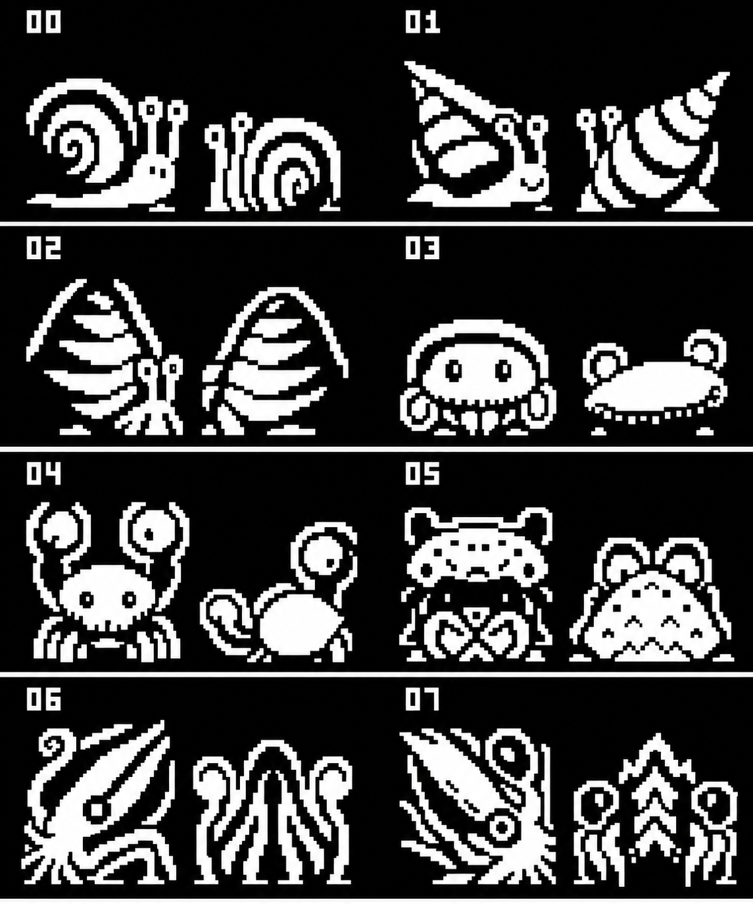
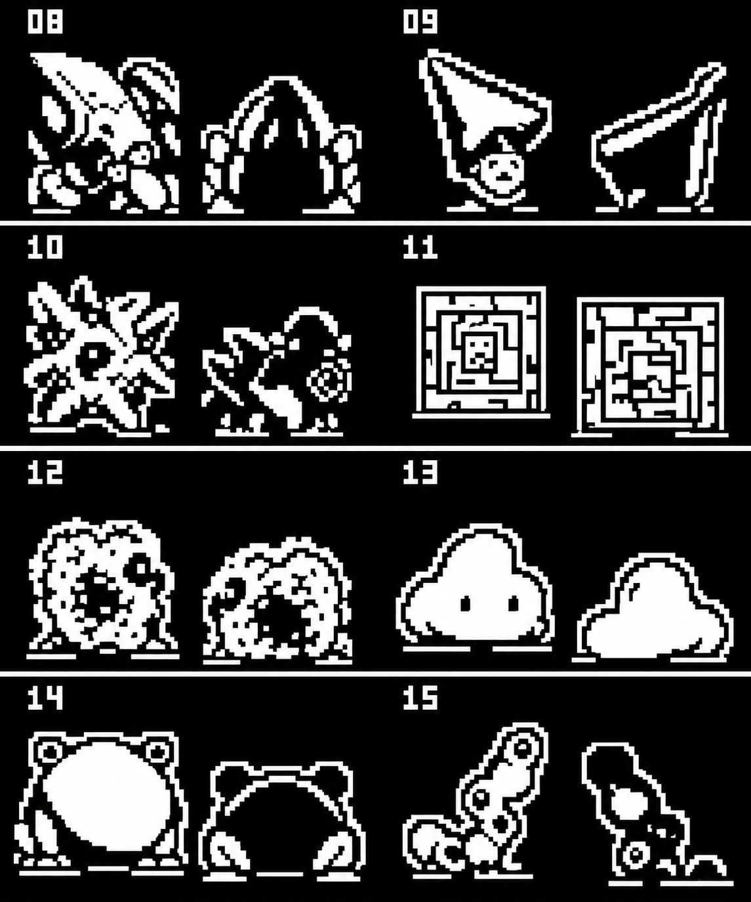
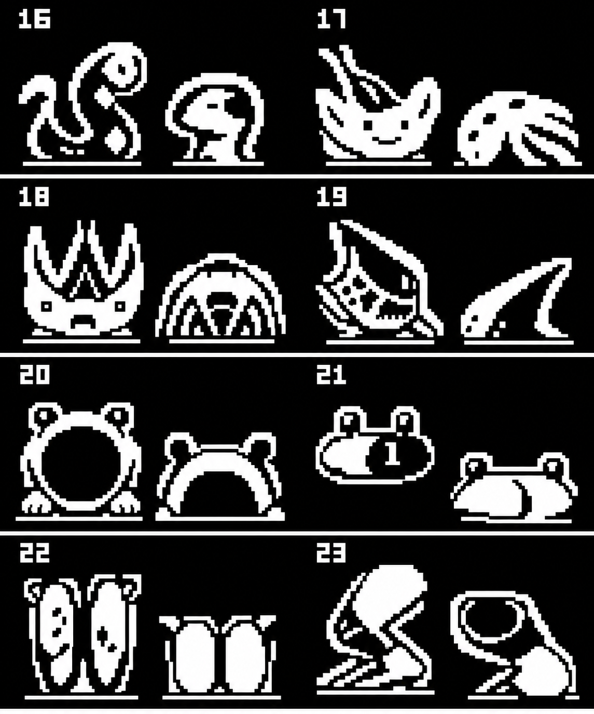
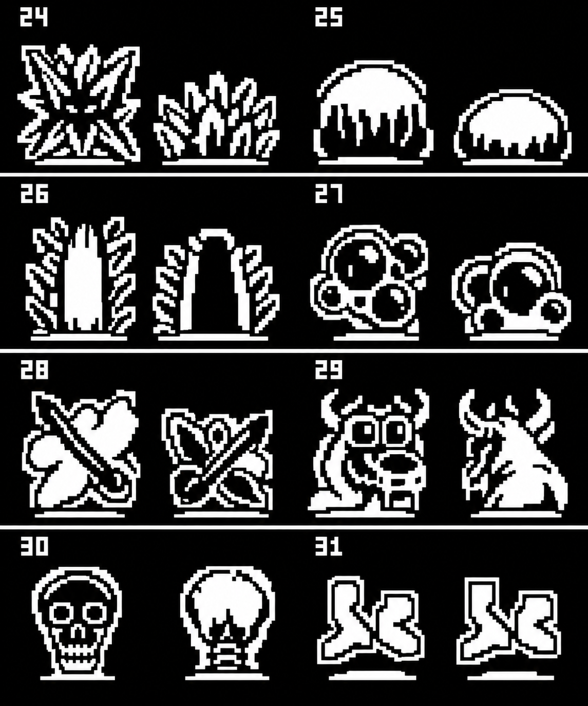

# Creature roster mockups

## Second redraw pass — 2026-10-07

All 32 original creatures now have updated paired boards in the
[gallery](creature-roster-mockups.html) and [roster](battle-roster-balance.html).
The expansion atlases supplied the style references: fuller bodies, chunky white
silhouettes, thick black seams, clearer faces, leaf and stone clusters, and more
distinct rear views. Original species identities and the two-column/four-row
board order remain. The earlier pass remains available in the gallery for comparison.

The four new files are `assets/creature-roster/mockup-v2-1.png` through
`mockup-v2-4.png`. They are enlarged concept boards, not native sprite tiles.
Built-in imagegen created the redraws; binary-palette export through the existing
PNG codec removes incidental antialias colors. All exported pixels are opaque
black or white. Exact prompts are in
[prompts-v2.json](assets/creature-roster/prompts-v2.json).

See also the [environment tile redraw](world-tiles-redraw.html).

CreatureGathererFX-dcj, 2026-10-06. All 32 species are grouped into four
eight-species boards. Each cell preserves the ID and its existing paired
battle views as the reference for stronger silhouette, negative space and
coarse monochrome detail. Names below come from data/json/creatures.json;
the source artwork, rather than assumptions about names, anchors identity.

[Open the visual gallery](creature-roster-mockups.html) ·
[Proposed gathering roster](creature-expansion-mockups.html)

These are imagegen art-direction sketches. Their enlarged pixels, cell
boundaries and palette are not validated 32x32 production sprites. Actual
replacement must preserve the existing 64x1024 masked source sheet, 64 frames
and 16384-byte payload, and be generated/packed through make gen. The boards
must not be cropped directly into the game. No canonical art or code changes.

Reference boards were rendered directly from the existing generated sprite
bytes (page-major interleaved pixel/mask; 256 bytes/frame). Every species
gets its two frame slots. Species 29/30/31 currently have empty second slots (frames 59/61/63).
The request for paired mockups proposes an additional view for these; the
prompt explicitly allows identical improved views for 30/31. Any additional
view remains a proposal, not evidence that it already exists in the source.

## IDs 00–07

00 SquibbleSnail · 01 SquableSnail · 02 ScrambleSnail · 03 SkitterCrab ·
04 ScatterCrab · 05 ShatterCrab · 06 squid · 07 bigsquid.

[Original reference board](assets/creature-roster/reference-1.png)

## IDs 08–15

08 BiggestSquid · 09 bell · 10 ember · 11 cuircuit · 12 hedge · 13 cloud ·
14 rock · 15 wiggleworm.

[Original reference board](assets/creature-roster/reference-2.png)

## IDs 16–23

16 waggleworm · 17 skimskate · 18 skimray · 19 billow · 20 howl · 21 item ·
22 item2 · 23 zip.

[Original reference board](assets/creature-roster/reference-3.png)

## IDs 24–31

24 zap · 25 suculent · 26 cactus · 27 flickerfly · 28 flitfly · 29 dragon ·
30 skull · 31 ardu.

[Original reference board](assets/creature-roster/reference-4.png)

Built-in imagegen used four original-reference boards plus the latest battle
screen as a style reference. Exact prompts are in
[creature-roster/prompts.json](assets/creature-roster/prompts.json).
Validation, resources and wall time are recorded in output.md.
